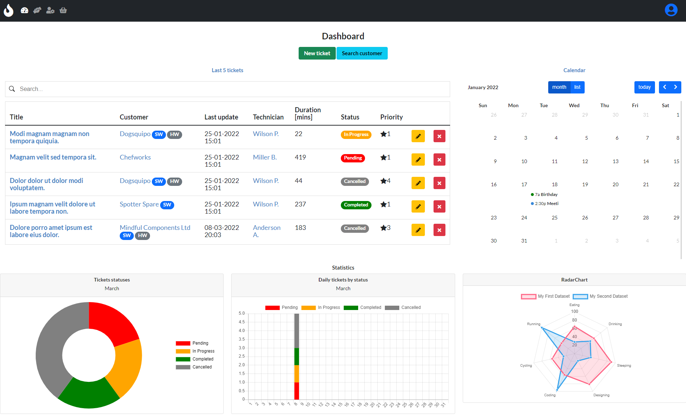

# hotline

[](https://gitpod.io/#https://GitHub.com/sannae/hotline) 
​[](https://open.vscode.dev/sannae/hotline)

Last screenshot:



## :pushpin: Todo
### Bugfixes/Partial:
- [ ] Complete all the CRUD operations on all the models
- [ ] Fix the `populate-db` management script to create records in the past
- [ ] Increase the Code Coverage percentage in the coverage layer in the CI workflow
- [ ] Separate settings for different environments, mostly for security reasons
### Features:
- [ ] Add a testing layer in the CI workflow
    - [ ] `test/test-models.py`
    - [ ] `test/test-views.py`
    - [ ] Add tests on each supported database platform (mostly MySQL, SQL Server and PostgreSQL)
- [ ] Add a linting layer in the CI workflow with [Flake8](https://flake8.pycqa.org/en/latest/)
- [ ] Add [container services](https://blog.healthchecks.io/2020/11/using-github-actions-to-run-django-tests/) to the CI workflow
- [ ] Add a button to automatically open GitHub issues directly on the dashboard (:light-bulb: not sure it's a good idea?)
- [ ] Add a mechanism in the deploy step in CI workflow to remove oldest tag on the Docker Hub repo
- [ ] Publish to Azure App Services (apparently [10 are for free](https://azure.microsoft.com/en-us/pricing/details/app-service/linux/))

## Quickstart

* Fork the project
* Activate Python virtual environment
```
python3 -m venv venv
```
* Install dependencies 
```
pip install --upgrade pip
pip install -r requirements.txt
```
* Run the Django development web server
```
python3 -m manage runserver
```

## Continuous integration


The CI/CD pipeline is handled using a [GitHub Actions workflow](./.github/workflows/build-docker-images.yml).

The workflow is divided into three sequential jobs (`test`, `build` and `deploy`).

The `test` job will:

* Create the list of dependencies using `pip freeze`
* Install the listed dependencies 
* Perform all the tests with the [Django testing suite](https://docs.djangoproject.com/en/4.0/topics/testing/)
* Measure code coverage using [coverage.py](https://coverage.readthedocs.io/en/6.3/)

The `build` job will:

* Run the `update-version.sh` script to update the patch version
* Run the `clean-images.sh` script to remove older local images from Docker
* Build the latest Docker image
* Tag the images with the version number

The `deploy` job will:

* Prepare the code for deployment by using the proper settings
* Run the Django built-in deployment checklist
* Push the `:latest` and the versioned image to DockerHub registry
* Clean up the local Docker environment by deleting the older images


